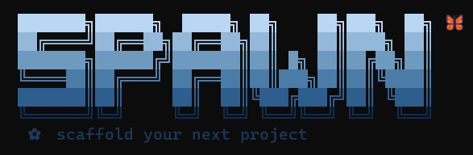

<div align="center">


> Eliminate repetitive project setup. Go from zero to a fully structured dev environment in seconds.

Spawn is a local CLI tool that transforms one command into a complete Python project foundation — directories, Git, dependencies, and a virtual environment set up automatically, so you can start building immediately.

[](https://python.org)
[](https://github.com/Abhiix0/spawn/actions)
[](LICENSE)
[](https://github.com/astral-sh/uv)

</div>

---

## The Problem Spawn Solves

Every new Python project starts with the same manual ritual:

```bash
mkdir my-project && cd my-project
mkdir src tests docs
touch README.md .gitignore
git init
python -m venv .venv && source .venv/bin/activate
...
```

It's repetitive. It's inconsistent. And you haven't written a single line of *real* code yet.

**Spawn collapses all of that into one command: `spawn create`**

---

## Features

| Feature | What it does |
|---|---|
| **Intent-based templates** | Backend API (FastAPI / Flask / Django), Python Script, Data Science, ML Project |
| **Extras system** | Opt-in ruff, pytest, Docker, GitHub Actions — installed and wired automatically |
| **Dependency installation** | `uv add` runs automatically with the right packages for your choices |
| **Git + uv** | Optionally runs `git init`, `uv init`, and `uv venv` |
| **GitHub publishing** | Connects your project to an existing GitHub repo and pushes the initial commit |
| **spawn doctor** | Scans your project for health indicators and scores it out of 100 |

---

## Prerequisites

- **Python 3.12+** — [Download here](https://python.org/downloads)
- **uv** — [Install guide](https://github.com/astral-sh/uv)
- **Git** — [Download here](https://git-scm.com/downloads)

> **First time with uv?** Run `pip install uv` or check their [quickstart](https://github.com/astral-sh/uv#getting-started).

---

## Installation

```bash
git clone https://github.com/Abhiix0/spawn.git
cd spawn
uv sync
uv tool install .
```

You can now run `spawn` from anywhere on your machine.

---

## Usage

```bash
spawn create
```

Spawn walks you through a short prompt sequence. The number of steps depends on the template you pick.

**Step 1 — Name your project**

```
Project Name: my-api
```

Spawn rejects names with spaces or special characters, and tells you immediately if that directory already exists.

**Step 2 — Pick a template**

```
  1  Backend API
  2  Python Script
  3  Data Science
  4  ML Project

Choose Template [1-4]: 1
```

**Step 3 — Framework and extras** *(Backend API only)*

```
  1  fastapi
  2  flask
  3  django

Choose Framework [1-3]: 1

  1  ruff
  2  pytest
  3  docker
  4  github-actions

  Enter numbers separated by commas, or press Enter to skip
Extras []: 1,2
```

**Step 4 — Git**

```
Initialize Git? [Y/n]: Y
```

That's it. Spawn generates the project, installs dependencies, and shows you exactly what to run next.

```
╭────── ✨ Project Created Successfully ──────╮
│                                              │
│  Project      my-api                         │
│  Template     Backend API                    │
│  Git          ✓ Enabled                      │
│  UV           ✓ Initialized                  │
│  Virtual Env  ✓ Created                      │
│                                              │
│  Next Steps                                  │
│    cd my-api                                 │
│    uv run uvicorn app.main:app --reload      │
│                                              │
╰──────────────────────────────────────────────╯
```

---

## Project Templates

### `[1]` Backend API

Best for: REST APIs, microservices, backend web apps.

Generates a production-structured project with a health endpoint, config module, and test file ready to run. Choose your framework and opt into extras — everything is installed automatically via `uv add`.

| Framework | Start command |
|---|---|
| FastAPI | `uv run uvicorn app.main:app --reload` |
| Flask | `uv run python run.py` |
| Django | `uv run python manage.py runserver` |

**Available extras:** `ruff` `pytest` `docker` `github-actions`

**FastAPI structure:**

```
my-api/
├── app/
│   ├── api/routes/health.py   # GET / → {"status": "running"}
│   ├── core/config.py         # pydantic-settings config
│   ├── models/
│   ├── schemas/
│   ├── services/
│   └── main.py
├── tests/
│   └── test_health.py
├── .env.example
├── README.md
└── .gitignore
```

```bash
# After generation
cd my-api
uv run uvicorn app.main:app --reload
# GET http://localhost:8000/ → {"status": "running"}
```

---

### `[2]` Python Script

Best for: automation scripts, utilities, one-off tools.

```
my-project/
├── main.py
├── src/
├── tests/
├── README.md
└── .gitignore
```

```bash
cd my-project
uv run python main.py
```

---

### `[3]` Data Science

Best for: exploratory analysis, reporting, Jupyter notebooks.

```
my-project/
├── main.py
├── data/
├── notebooks/
├── src/
├── docs/
├── tests/
├── README.md
└── .gitignore
```

```bash
cd my-project
uv add pandas numpy matplotlib
uv run python main.py
```

---

### `[4]` ML Project

Best for: model training, feature engineering, experiments.

```
my-project/
├── main.py
├── data/
├── models/
├── src/
├── docs/
├── tests/
├── README.md
└── .gitignore
```

```bash
cd my-project
uv add pandas numpy scikit-learn
uv run python main.py
```

---

## Other Commands

### `spawn doctor`

Scans your project directory for health indicators and scores it out of 100.

```bash
spawn doctor
spawn doctor ./path/to/project
```

```
╭─────────────── 🏥 Project Health Report ───────────────╮
│                                                          │
│  Documentation                                           │
│  ✓ README.md — Documentation file present               │
│  ⚠ LICENSE — Missing LICENSE file                       │
│                                                          │
│  Version Control                                         │
│  ✓ Git Repository — Git initialized                     │
│  ✓ .gitignore — Git ignore configured                   │
│                                                          │
│  Quality                                                 │
│  ✓ Tests — Test directory configured                    │
│  ✓ Ruff — Ruff configured in pyproject.toml             │
│  ✓ Pytest — Pytest configured in pyproject.toml         │
│                                                          │
│  Deployment                                              │
│  ⚠ Dockerfile — Missing Dockerfile                      │
│  ✓ GitHub Actions — GitHub Actions configured           │
│                                                          │
│  Configuration                                           │
│  ✓ .env.example — Environment template present          │
│                                                          │
│  Project Score: 80/100 (80%)                            │
╰──────────────────────────────────────────────────────────╯
```

### `spawn version`

```bash
spawn version
# → Spawn v0.3.0
```

### Publish to GitHub

After creation, if Git was enabled, Spawn asks:

```
Publish to GitHub? [y/N]: y
Repository URL: https://github.com/your-username/my-project
```

Spawn stages all files, creates the initial commit, renames the branch to `main`, adds the remote, and pushes.

> The repository must already exist on GitHub. Spawn connects to it — it does not create it.

---

## Running the Tests

```bash
uv run pytest
```

All tests should pass. If they don't, please [open an issue](https://github.com/Abhiix0/spawn/issues).

---

## Roadmap

- [x] **GitHub publishing** — connect and push to an existing GitHub repo (v0.2.0)
- [x] **Backend API intent** — FastAPI, Flask, Django with production structure (v0.3.0)
- [x] **Extras system** — ruff, pytest, Docker, GitHub Actions installed automatically (v0.3.0)
- [x] **Dependency installation** — `uv add` runs automatically after generation (v0.3.0)
- [ ] **CLI Application intent** — Typer-based CLI scaffold (v0.4.0)
- [ ] **Automation Tool intent** — scripting and scheduling scaffold (v0.5.0)
- [ ] **AI Chatbot intent** — LLM-integrated chat app scaffold (v0.6.0)
- [ ] **AI Agent intent** — tool-calling agent scaffold (v0.7.0)
- [ ] **RAG System intent** — retrieval-augmented generation scaffold (v0.8.0)
- [ ] **Data Project intent** — analysis, dashboard, ETL, ML sub-options (v0.9.0)

---

## Contributing

Contributions are welcome. Whether it's a bug fix, a new intent, or something from the roadmap — here's how to get started.

### Adding a new intent

**1. Create the intent directory**

```
src/spawn/templates/your_intent/
├── __init__.py    ← subclass BaseTemplate
└── content.py     ← all file content as string constants
```

**2. Register it**

In `src/spawn/core/registry.py`, add a `TemplateMetadata` entry to `TEMPLATES` with your slug, display name, description, template class, and any `available_frameworks` or `available_extras`.

**3. Write tests**

Add coverage in `tests/test_templates.py` and `tests/test_generator.py`. Mock `initialize_uv` and `install_packages` in generator tests.

### Before submitting a PR

```bash
uv run pytest        # must pass
uv run ruff check .  # must be clean
```

---

## License

This project is open source under the [MIT License](LICENSE).

---

<div align="center">

**[Star on GitHub](https://github.com/Abhiix0/spawn)** · **[Report a Bug](https://github.com/Abhiix0/spawn/issues)** · **[Request a Feature](https://github.com/Abhiix0/spawn/issues)**

</div>